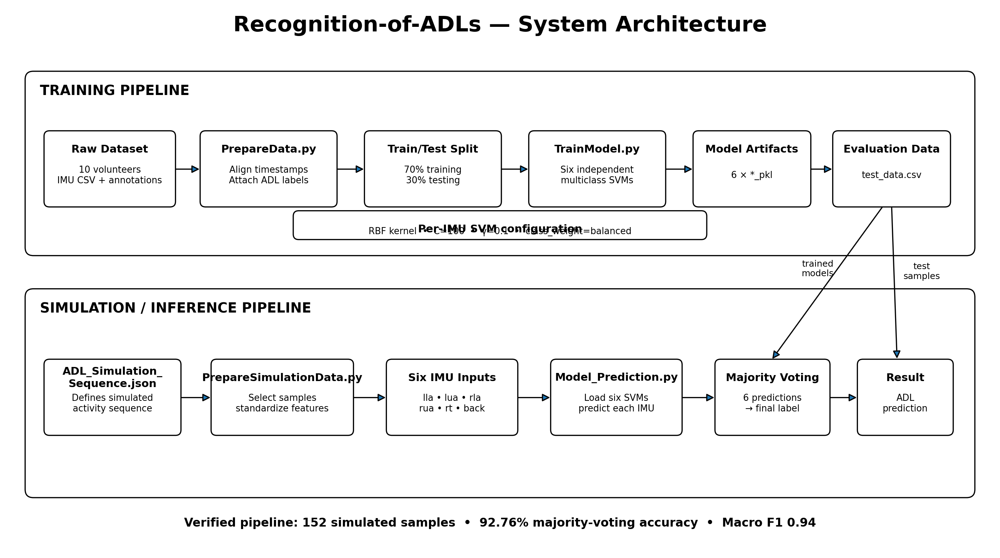
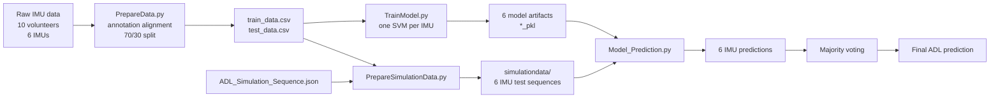
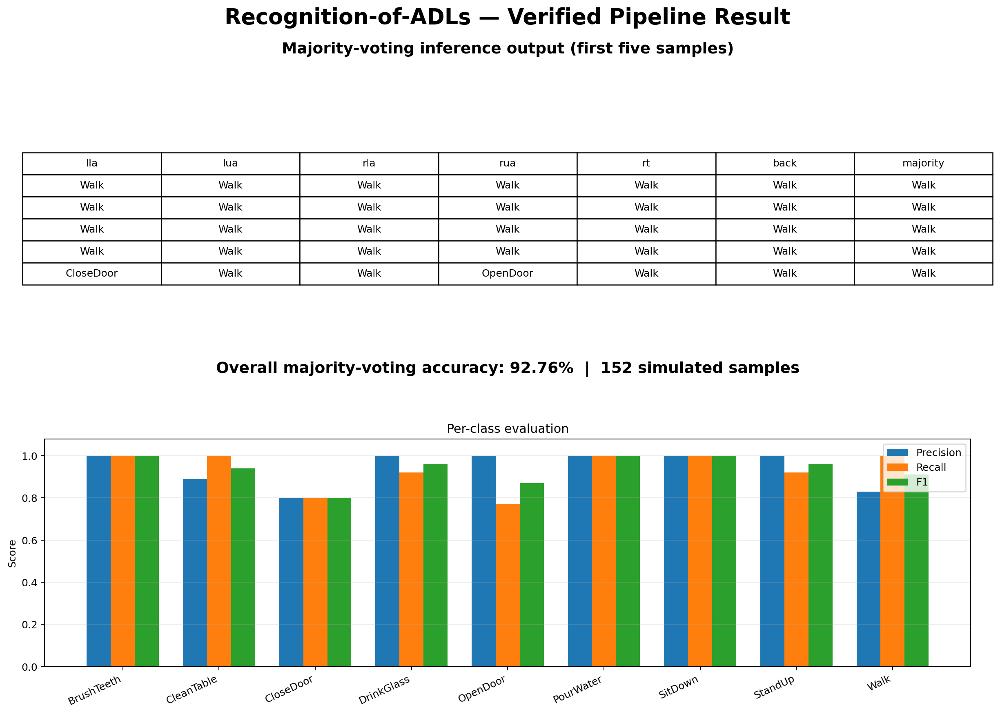

# Recognition-of-ADLs

Human Activity Recognition (HAR) for Activities of Daily Living (ADLs) using six IMUs and independent SVM classifiers with majority voting.

## Overview

This repository implements a six-IMU ADL recognition pipeline. Sensor measurements are aligned with annotated activities, split into training and testing data, and used to train one multiclass SVM for each IMU. During inference, the six individual predictions are combined with majority voting to produce the final ADL classification.

The pipeline supports:

- 6 IMU modules: `lla`, `lua`, `rla`, `rua`, `rt`, `back`
- 9 ADLs:
  - `Walk`
  - `OpenDoor`
  - `CloseDoor`
  - `BrushTeeth`
  - `SitDown`
  - `DrinkGlass`
  - `CleanTable`
  - `StandUp`
  - `PourWater`
- 10 volunteers
- 70/30 stratified train/test split
- One RBF SVM per IMU
- Six-way majority voting during inference

## Architecture



### Pipeline



## Data preparation

`PrepareData.py` reads each volunteer's annotations and IMU recordings. Annotation intervals are matched to sensor timestamps and labelled with the corresponding ADL.

The resulting dataset contains:

- 170,012 prepared samples in the verified repository state
  - 119,008 training samples
  - 51,004 test samples
- 70% training data
- 30% testing data
- sensor feature columns `0`–`9`
- `ADL`
- `module`

The committed generated test artifact contains 51,004 rows.

## Model training

`TrainModel.py` trains six independent multiclass SVMs.

Configuration:

```text
kernel = RBF
C = 100
gamma = 0.1
class_weight = balanced
random_state = 0
```

Models:

```text
model/lla_pkl
model/lua_pkl
model/rla_pkl
model/rua_pkl
model/rt_pkl
model/back_pkl
```

The repository's model artifacts were created with scikit-learn 1.0.2. The environment is therefore pinned to the compatible versions rather than upgrading the model format.

## Simulation and inference

`PrepareSimulationData.py` reads `ADL_Simulation_Sequence.json`, constructs the simulated input sequence for each IMU, pads missing rows when required, and standardizes the features.

`Model_Prediction.py` then:

1. Loads the six trained SVMs.
2. Runs prediction for each IMU.
3. Stores the individual predictions.
4. Combines the six predictions using majority voting.
5. Reports accuracy and the classification report.

## Verified result

The complete pipeline was executed successfully with the pinned environment.

```text
Python        3.10.14
NumPy         1.26.4
Pandas        1.5.3
SciPy         1.10.1
scikit-learn  1.0.2
```

Verified inference result:

```text
Accuracy: 92.763%
Samples:  152
Macro F1: 0.94
```



Per-class F1:

| ADL | Precision | Recall | F1 |
|---|---:|---:|---:|
| BrushTeeth | 1.00 | 1.00 | 1.00 |
| CleanTable | 0.89 | 1.00 | 0.94 |
| CloseDoor | 0.80 | 0.80 | 0.80 |
| DrinkGlass | 1.00 | 0.92 | 0.96 |
| OpenDoor | 1.00 | 0.77 | 0.87 |
| PourWater | 1.00 | 1.00 | 1.00 |
| SitDown | 1.00 | 1.00 | 1.00 |
| StandUp | 1.00 | 0.92 | 0.96 |
| Walk | 0.83 | 1.00 | 0.91 |

## Demo

The terminal recording below shows the complete pipeline being executed from the reproducible environment, including data preparation, model training, simulation-data preparation, inference, majority voting, and the final evaluation result.

[Pipeline execution demo](demo.mp4)


## Reproducible environment

The project now uses `uv` with pinned dependencies:

```text
Python       >=3.10,<3.11
NumPy        1.26.4
Pandas       1.5.3
SciPy        1.10.1
scikit-learn 1.0.2
```

Install the environment with:

```bash
uv sync
```

The lock file `uv.lock` records the resolved dependency graph.

## Running the complete pipeline

After cloning the repository:

```bash
cd Recognition-of-ADL-s
uv sync
./run.sh
```

`run.sh` executes:

```text
PrepareData.py
TrainModel.py
PrepareSimulationData.py
Model_Prediction.py
```

The scripts use paths relative to the repository, so the pipeline no longer depends on the original developer path `/home/zaid/project/...`.

## Repository structure

```text
Recognition-of-ADL-s/
├── data/
│   ├── volunteer_01/
│   ├── ...
│   └── volunteer_10/
├── model/
│   ├── back_pkl
│   ├── lla_pkl
│   ├── lua_pkl
│   ├── rla_pkl
│   ├── rt_pkl
│   └── rua_pkl
├── output/
│   ├── Output.png
│   ├── final_output.csv
│   ├── test_data.csv
│   └── train_data.csv
├── simulationdata/
├── ADL_Simulation_Sequence.json
├── PrepareData.py
├── TrainModel.py
├── PrepareSimulationData.py
├── Model_Prediction.py
├── run.sh
├── pyproject.toml
└── uv.lock
```

## Reproducibility changes

The current work focuses on making the original project reproducible on a new machine without editing source paths manually.

Implemented changes:

- Removed hard-coded paths.
- Added repository-relative path resolution using `pathlib`.
- Replaced deprecated pandas `DataFrame.append()` usage with `pd.concat()`.
- Updated `run.sh` to resolve its own repository root.
- Added `set -e` so pipeline execution stops on failure.
- Added `pyproject.toml`.
- Added `uv.lock`.
- Pinned dependency versions compatible with the existing SVM pickle artifacts.
- Verified the complete pipeline end-to-end.

## Original project

This repository is based on the original Recognition-of-ADLs university project and its existing dataset, trained model artifacts, simulation sequence, and inference pipeline. The work documented here focuses on reproducing the project, understanding its implementation, and making the existing pipeline reproducible on a new environment.